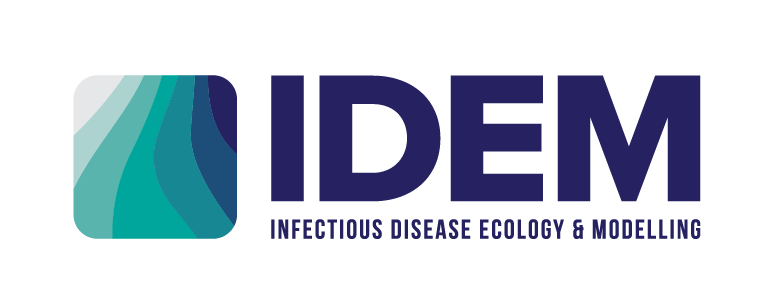

The [Infectious Disease Ecology and Modelling Team](https://www.thekids.org.au/our-research/brain-and-behaviour/child-health-analytics-research-program/infectious-disease-ecology-and-modelling/) from The Kids Research Institute Australia led by [Professor Nick Golding](https://github.com/goldingn), combines mathematical and statistical modelling, ecology, and public health to address malaria and other infectious and vector-borne diseases. 
The team uses modelling and maps to measure the risk posed by some of the world’s most important and neglected diseases – including malaria, Japanese Encephalitis Virus and COVID-19 – and provide rapid modelling analyses to policy makers.

